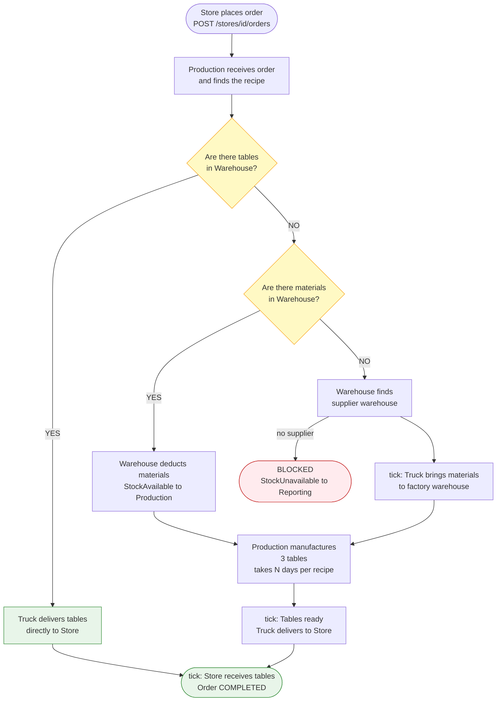
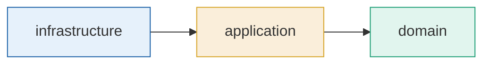

# Supply Chain Simulator

Distributed system that simulates a supply chain between factories, warehouses and stores.

## Teams

| Service | Team member | Role |
|---|---|---|
| Paso del Tiempo + Mapa | Rubén | Open Host Service — upstream of all |
| Fábricas + Recetas | Idoia | Customer/Supplier — downstream of Time |
| Almacenes | Pau | Core Domain — central node |
| Camiones | Sergi | Conformist — downstream of Almacenes |
| Reportes | Pedro | Anticorruption Layer — downstream of all |

## Context Map

## Main flow — UC-05: Store orders 3 tables

> tick = user clicks Advance Day

## Dependency rule (applies to all services)

`domain` never depends on JPA, RabbitMQ or any external framework.

## Tech stack

- Java 21 + Spring Boot 3
- PostgreSQL + Liquibase
- RabbitMQ (topic exchanges)
- SpringDoc OpenAPI
- JUnit 5 + AssertJ + Awaitility + Testcontainers
- Lombok
- Docker Compose
- GitHub Actions
