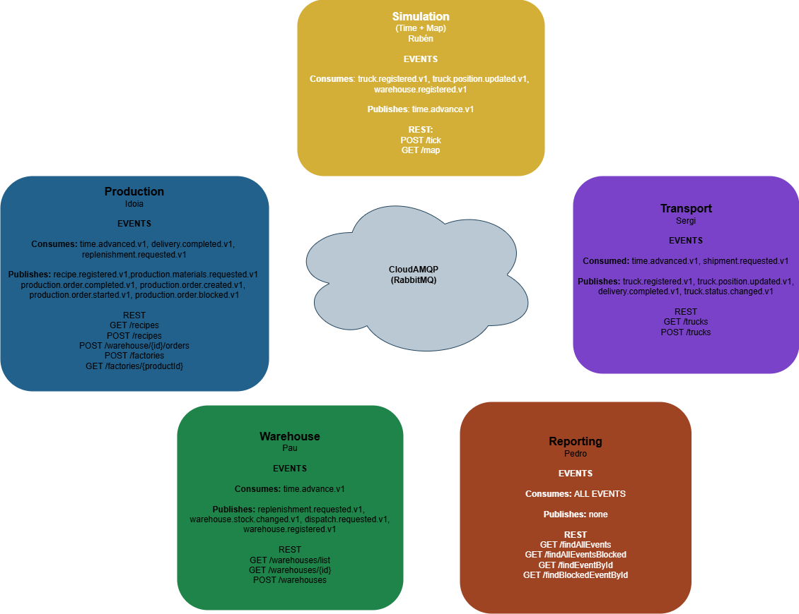
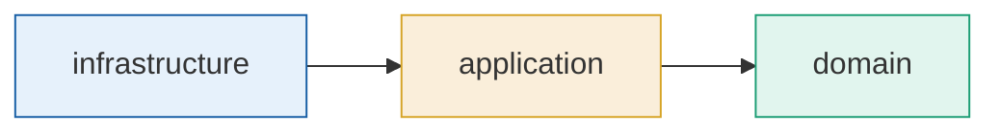

# Supply Chain Simulator

Distributed system that simulates a supply chain between factories, warehouses and stores.

## Project Links

| Area | Link |
|---|---|
| General repository | [PauLopNun/supply-chain-simulator-workshop](https://github.com/PauLopNun/supply-chain-simulator-workshop.git) |
| Trello board | [Trello](trello) |
| Simulation - Time + Map | [fraarrmat11/MS-SIMULATION](https://github.com/fraarrmat11/MS-SIMULATION) |
| Factories / Production | [Fepe7/Factory-Workshop-Gft](https://github.com/Fepe7/Factory-Workshop-Gft) |
| Warehouses | [Esmeralda6/Warehouse-Workshop](https://github.com/Esmeralda6/Warehouse-Workshop) |
| Trucks / Transport | [PauLopNun/transport-service](https://github.com/PauLopNun/transport-service) |

## Teams

| Service | Team member | Role |
|---|---|---|
| Time Passage + Map | Ruben | Open Host Service - upstream of all |
| Factories + Recipes | Idoia | Customer/Supplier - downstream of Time |
| Warehouses | Pau | Core Domain - central node |
| Trucks | Sergi | Conformist - downstream of Warehouses |
| Reports | Pedro | Anticorruption Layer - downstream of all |

## Context Map



## Main flow - UC-05: Store orders 3 tables

```mermaid
flowchart TD
    S1([Store places order\nREST POST /stores/{id}/orders]) --> S2
    S2[Production creates order\nand finds recipe] --> S3
    S3[Production publishes\nproduction.materials.requested.v1] --> S4
    S4{Warehouse can reserve\nfinished product?}
    S4 -->|YES| SP
    S4 -->|NO| S5
    SP[Warehouse publishes\nshipment.requested.v1\nWarehouse -> Store] --> T1
    S5{Warehouse can reserve\nrecipe materials?}
    S5 -->|YES| SM
    S5 -->|NO| S6
    SM[Warehouse publishes\nshipment.requested.v1\nWarehouse -> Factory] --> T2
    S6{Supplier warehouse\nhas stock?}
    S6 -->|YES| SS
    S6 -->|NO| BLK
    SS[Warehouse publishes\nshipment.requested.v1\nSupplier -> Factory] --> T2
    T2[Transport publishes\ndelivery.completed.v1\nmaterials arrived] --> P1
    P1[Production starts manufacturing\nproduction.order.started.v1] --> P2
    P2([REST POST /tick]) --> TIME
    TIME[Simulation publishes\ntime.advanced.v1] --> P3
    P3[Production advances order] --> P4
    P4{Production completed?}
    P4 -->|NO| P2
    P4 -->|YES| P5[Production publishes\nproduction.order.completed.v1]
    P5 --> SP
    T1[Transport publishes\ntruck.position.updated.v1\nwhile moving] --> T3
    T3[Transport publishes\ndelivery.completed.v1\nstore received goods] --> END
    BLK([BLOCKED\nproduction.order.blocked.v1\nto Reporting])
    END([Order COMPLETED])

    style END fill:#e8f5e9,stroke:#388e3c
    style BLK fill:#ffebee,stroke:#c62828
    style S4 fill:#fff9c4,stroke:#f9a825
    style S5 fill:#fff9c4,stroke:#f9a825
    style S6 fill:#fff9c4,stroke:#f9a825
    style P4 fill:#fff9c4,stroke:#f9a825
```

> `POST /tick` is the user command. `time.advanced.v1` is the event that lets every service advance its own state.

## REST vs Events

Use REST for commands and queries where the caller needs an immediate acknowledgement or a current read model.

| Case | Integration style | Examples |
|---|---|---|
| User/admin command | REST command | `POST /tick`, `POST /trucks`, `POST /factories`, `POST /recipes`, `POST /stores/{id}/orders` |
| UI/read model bootstrap | REST query | `GET /map`, `GET /trucks`, `GET /recipes`, reporting dashboards |
| Business fact that already happened | RabbitMQ event | `time.advanced.v1`, `truck.registered.v1`, `truck.position.updated.v1`, `delivery.completed.v1`, `production.order.completed.v1` |
| Long-running cross-service workflow | RabbitMQ event/command message | `production.materials.requested.v1`, `shipment.requested.v1`, `replenishment.requested.v1` |
| Audit/projections | RabbitMQ event fan-out | Reporting consumes events from all services |

Avoid REST for cross-service state changes that start a long process, such as requesting a shipment or reacting to a time advance. Avoid queues for direct UI reads, such as loading the current map or truck list.

Current contract gaps to align before implementation:

- Warehouse should publish an explicit result for `production.materials.requested.v1`, for example `warehouse.materials.reserved.v1`. `warehouse.stock.changed.v1` is useful for projections, but it is too generic as a workflow response.
- Transport currently documents and configures `shipment.requested.v1`, but its listener adapter is still empty in `transport-service`.
- Reporting should consume `truck.status.changed.v1` instead of the older `truck.assigned.v1` / `delivery.created.v1` names.

## Dependency Rule



`domain` never depends on JPA, RabbitMQ or any external framework.

## Naming Conventions

### Branches

Format: `type/short-description`

Valid types: `feature` `fix` `chore` `docs` `test` `refactor`

Examples:

    feature/truck-assignment
    fix/stock-checker-null-pointer
    chore/setup-rabbitmq-config

### Commits

Format: `type: short description`

Valid types: `feat` `fix` `chore` `docs` `test` `refactor`

Examples:

    feat: add optimal truck selector
    fix: handle null stock when warehouse is empty
    chore: add liquibase migration for warehouse table

> Both conventions are enforced automatically by the CI pipeline on every push and pull request.

## Tech Stack

- Java 21 + Spring Boot 3
- PostgreSQL + Liquibase
- RabbitMQ (topic exchanges)
- SpringDoc OpenAPI
- JUnit 5 + AssertJ + Awaitility + Testcontainers
- Lombok
- Docker Compose
- GitHub Actions

---

## Definition of Ready

*A task is ready to be developed when:*

- [ ] The description is clear and the team understands it without needing to ask
- [ ] The messaging contracts it depends on are agreed and documented
- [ ] Dependencies with other teams are identified and unblocked
- [ ] Acceptance criteria are defined
- [ ] The team has estimated it

---

## Definition of Done

*A task is done when:*

- [ ] The code is on a branch following the correct format (`feature/`, `fix/`, etc.)
- [ ] Commits follow the format `type: short description`
- [ ] The PR is open, reviewed and approved by at least one team member
- [ ] The domain has no dependencies on JPA, RabbitMQ or any external framework
- [ ] Domain unit tests pass
- [ ] Integration tests with Testcontainers pass (RabbitMQ + PostgreSQL)
- [ ] A Liquibase migration is included if there are database changes
- [ ] Any published or consumed contract is documented in `contracts-doc.md`
- [ ] The GitHub Actions pipeline is green
