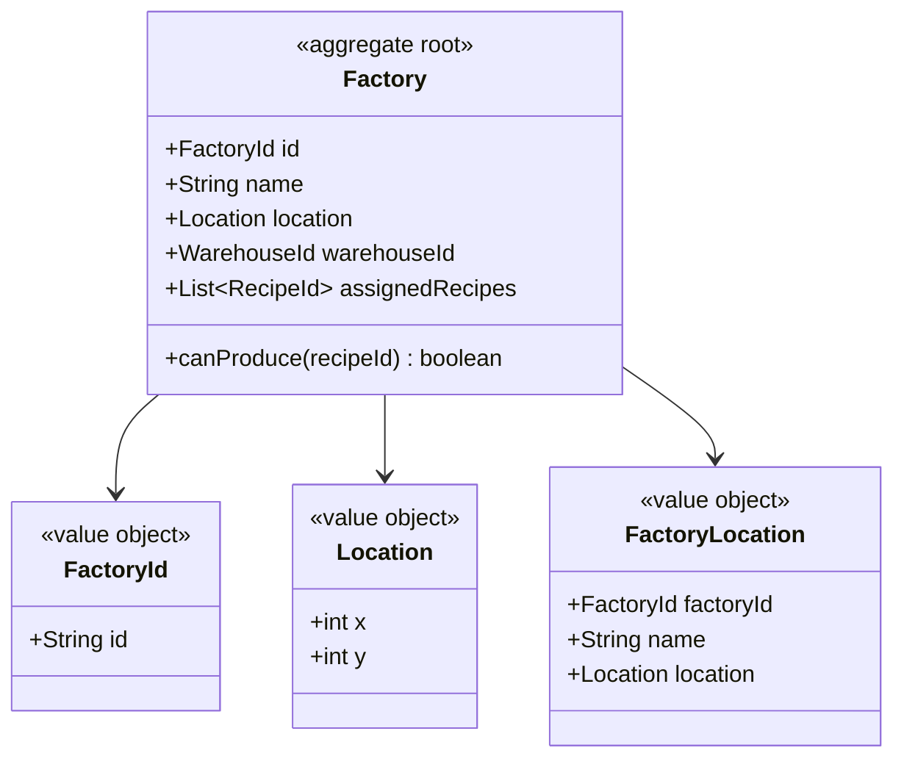
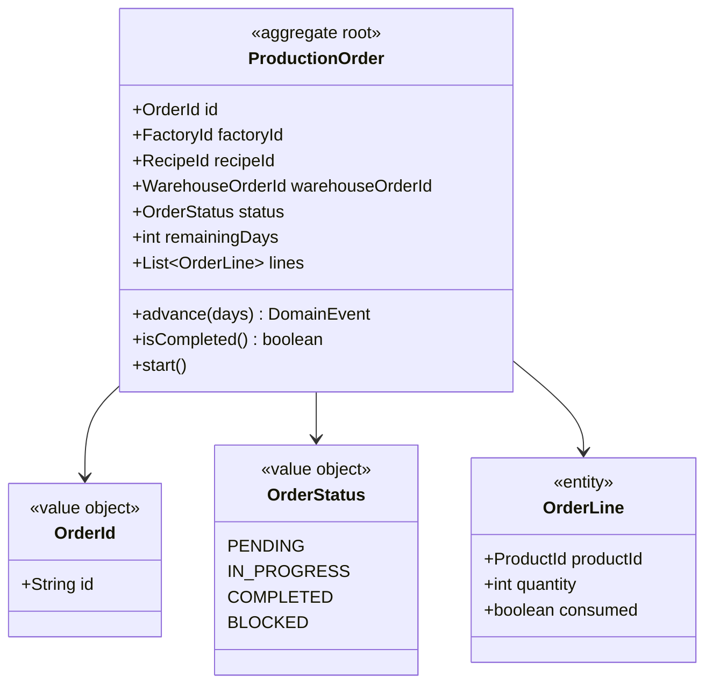
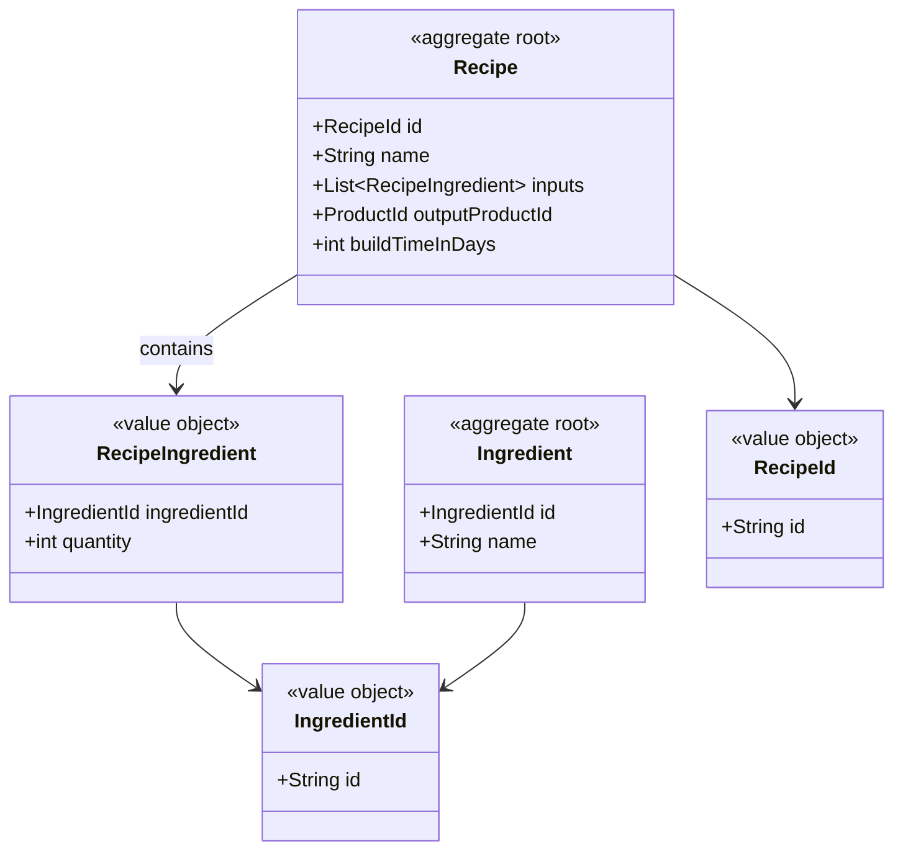
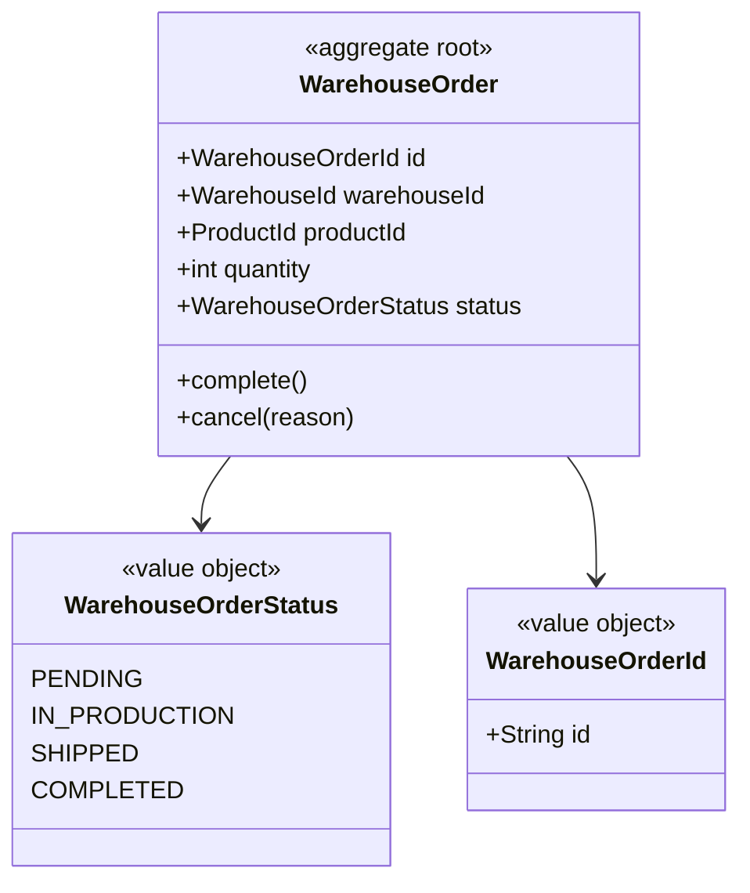
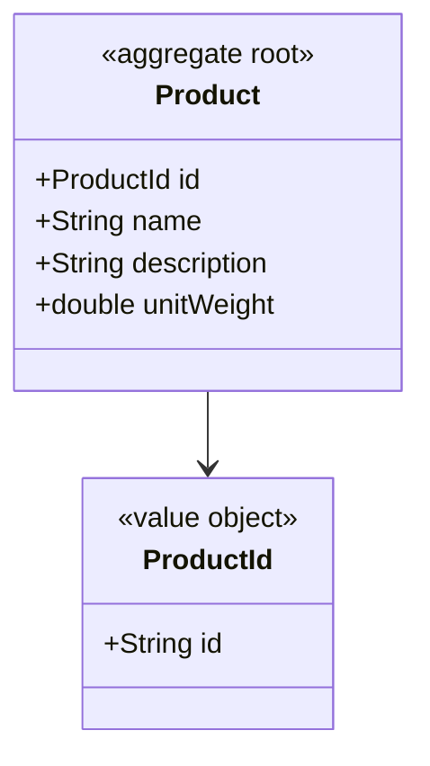
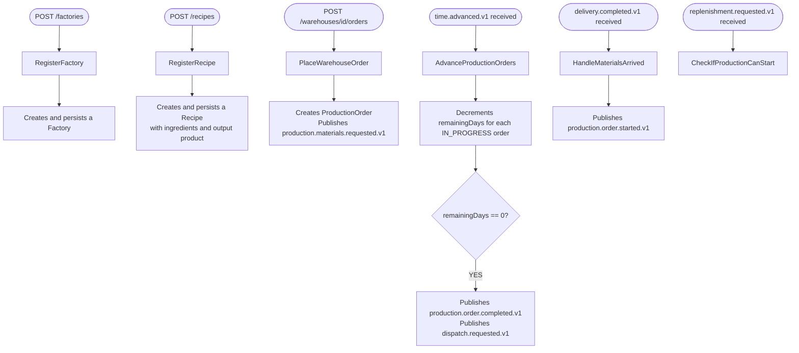

# Prouction — Idoia

Manages factories, recipes, production orders and store orders.

## Modules

### Module: factory

### Module: production-order

### Module: recipe

### Module: warehouse-order

### Module: product

## Use cases

## Events sent

| Event | Consumed by |
|---|---|
| factory.registered.v1 | Time/Map, Reporting |
| dispatch.requested.v1 | Transport |
| production.materials.requested.v1 | Warehouse |
| production.order.completed.v1 | Warehouse, Reporting |
| production.order.created.v1 | Reporting |
| production.order.started.v1 | Reporting |
| production.order.blocked.v1 | Reporting |

### Events consumed

| Event | Received by |
|---|---|
| time.advanced.v1 | Time |
| delivery.completed.v1 | Transport, Warehouse |
| repelnishment.requested.v1 | Warehouse |
