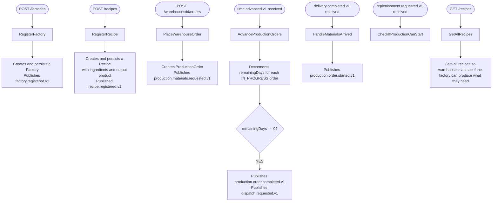
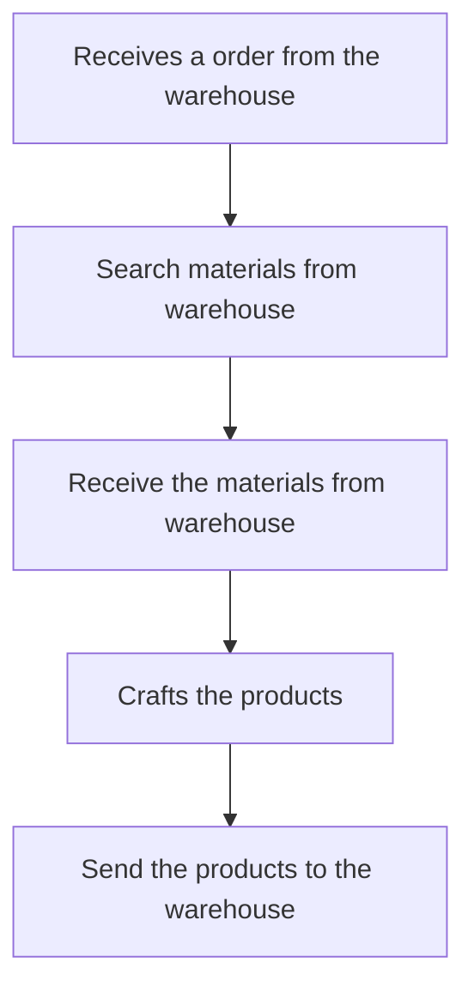

# Production — Idoia

Manages factories, recipes, production orders and store orders.

## Core Domain Model

```mermaid
classDiagram
    %% =======================
    %% FACTORY AGGREGATE
    %% =======================
    class Factory {
        <<aggregate root>>
        +FactoryId id
        +String name
        +Location location
        +WarehouseId warehouseId
        +List~RecipeId~ assignedRecipes
        +canProduce(recipeId) boolean
    }
    class FactoryId {
        <<value object>>
        +UUID id
    }
    class Location {
        <<value object>>
        +int x
        +int y
    }
    
    Factory --> FactoryId
    Factory --> Location
    %% =======================
    %% PRODUCTION ORDER AGGREGATE
    %% =======================
    class ProductionOrder {
        <<aggregate root>>
        +OrderId id
        +FactoryId factoryId
        +RecipeId recipeId
        +WarehouseOrderId warehouseOrderId
        +OrderStatus status
        +int remainingDays
        +advance(days) DomainEvent
        +isCompleted() boolean
        +start()
    }
    class OrderId {
        <<value object>>
        +UUID id
    }
    class OrderStatus {
        <<value object>>
        PENDING
        IN_PROGRESS
        COMPLETED
        BLOCKED
    }
    
    ProductionOrder --> OrderId
    ProductionOrder --> OrderStatus
    %% =======================
    %% RECIPE & INGREDIENT
    %% =======================
    class Recipe {
        <<aggregate root>>
        +RecipeId id
        +String name
        +List~RecipeIngredient~ inputs
        +ProductId outputProductId
        +int buildTimeInDays
    }
    class RecipeIngredient {
        <<value object>>
        +IngredientId ingredientId
        +int quantity
    }
    class Ingredient {
        <<entity>>
        +IngredientId id
        +String name
    }
    class IngredientId {
        <<value object>>
        +UUID id
    }
    class RecipeId {
        <<value object>>
        +UUID id
    }
    class MaterialRequest {
        <<entity>>
        +MaterialRequestId id
        +List~RecipeIngredients~ itemsRequest
    }
    class MaterialRequestId {
        <<value object>>
        +UUID id
    }
    
    Recipe --> RecipeId
    Recipe --> RecipeIngredient : contains
    RecipeIngredient --> IngredientId
    Ingredient --> IngredientId
    MaterialRequest --> MaterialRequestId
    MaterialRequest --> RecipeIngredient
    
    %% =======================
    %% WAREHOUSE ORDER AGGREGATE
    %% =======================
    class WarehouseOrder {
        <<aggregate root>>
        +WarehouseOrderId id
        +WarehouseId warehouseId
        +ProductId productId
        +int quantity
        +WarehouseOrderStatus status
        +complete()
        +cancel(reason)
    }
    class WarehouseOrderId {
        <<value object>>
        +UUID id
    }
    class WarehouseOrderStatus {
        <<value object>>
        PENDING
        IN_PRODUCTION
        COMPLETED
    }
    
    WarehouseOrder --> WarehouseOrderStatus
    WarehouseOrder --> WarehouseOrderId

    %% =======================
    %% PRODUCT
    %% =======================
    class Product {
        <<entity>>
        +ProductId id
        +String name
        +String description
    }
    class ProductId {
        <<value object>>
        +UUID id
    }
    
    Product --> ProductId
    %% =======================
    %% CROSS-AGGREGATE RELATIONSHIPS
    %% =======================
    Factory ..> RecipeId : assigns
    ProductionOrder ..> FactoryId : placed at
    ProductionOrder ..> RecipeId : uses
    ProductionOrder ..> WarehouseOrderId : fulfills
    Recipe ..> ProductId : produces
    WarehouseOrder ..> ProductId : requests
```

## Events Schema

## Use case

## Event Table

### Events Sent

| Event | Consumed by | Type |
|---|---|---|
| recipe.registered.v1 | Reporting | Factory |
| production.materials.requested.v1 | Warehouse | MaterialsRequested |
| production.order.completed.v1 | Warehouse, Reporting | WarehouseOrder |
| production.order.created.v1 | Reporting | ProductionOrder |
| production.order.started.v1 | Reporting | ProductionOrder |
| production.order.blocked.v1 | Reporting | ProductionOrder |

### Events Consumed

| Event | Received by | Type |
|---|---|---|
| time.advanced.v1 | Time |  |
| delivery.completed.v1 | Warehouse | boolean |
| replenishment.requested.v1 | Warehouse | ReplenishRequest |
