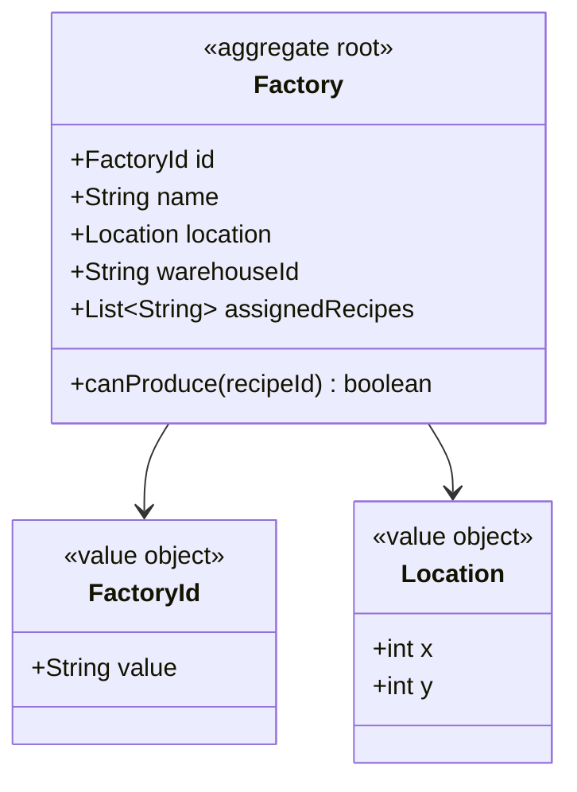
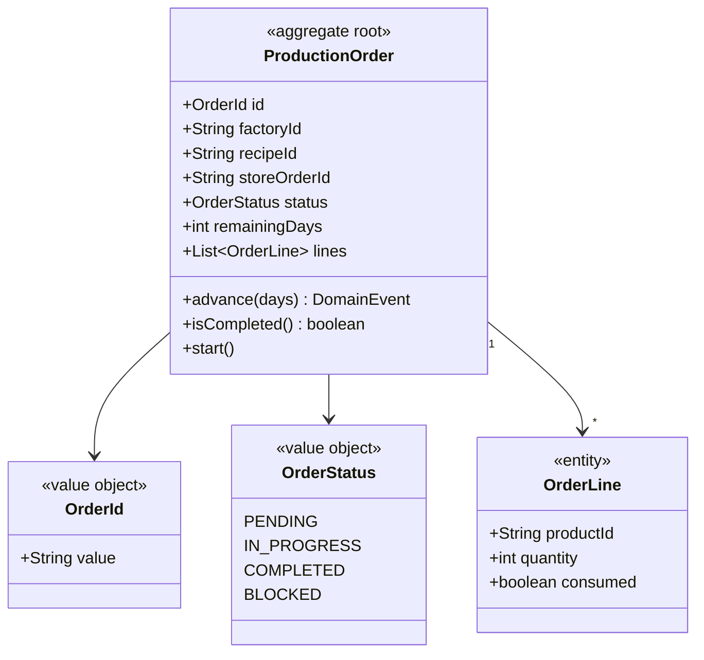
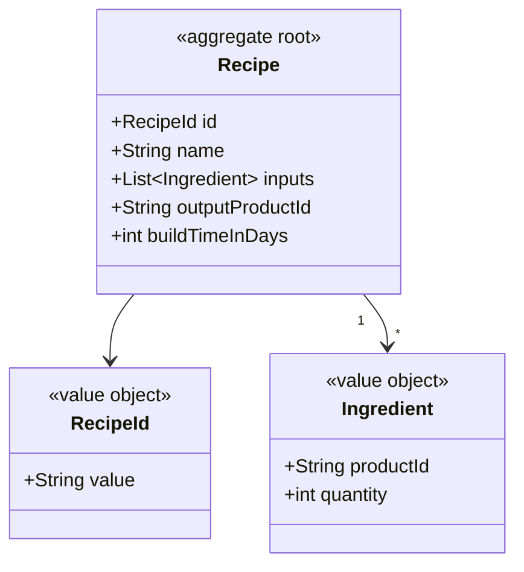
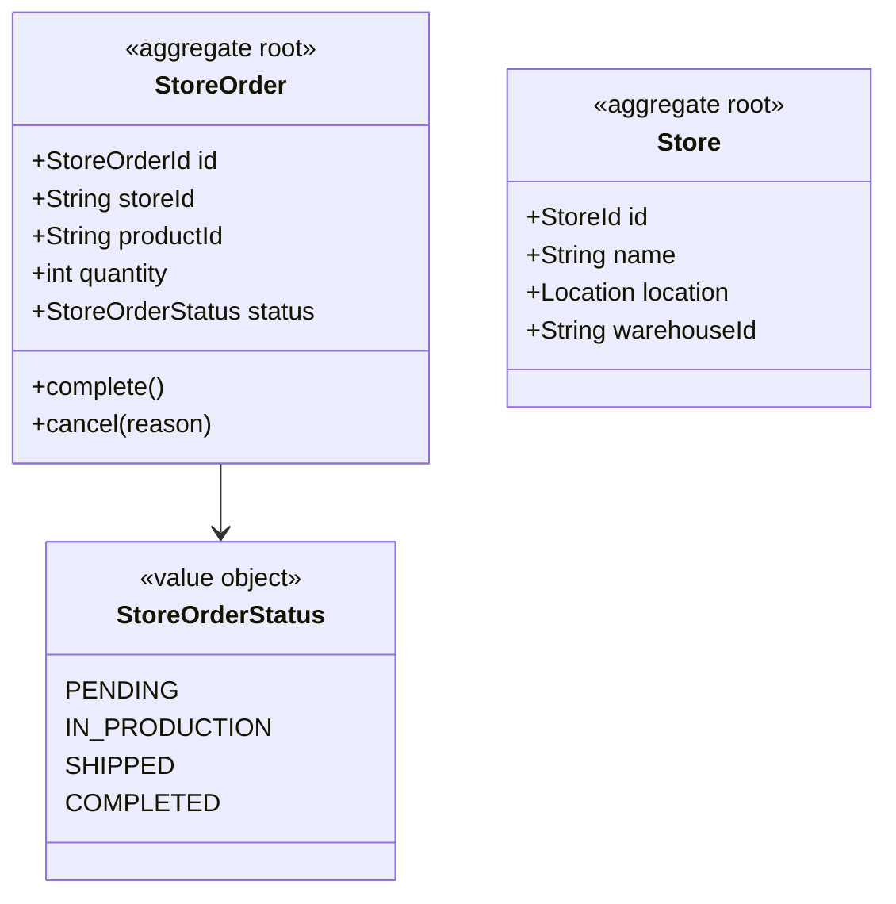

# Production — Idoia

Manages factories, recipes, production orders and store orders.

## Modules

### Module: factory



### Module: production-order



### Module: recipe



### Module: store-order



## Use cases


## Events published

| Event | Consumed by |
|---|---|
| production.order.created.v1 | Reporting |
| production.order.started.v1 | Reporting |
| production.order.blocked.v1 | Reporting |
| production.order.completed.v1 | Warehouse, Reporting |
| production.materials.requested.v1 | Warehouse |
| dispatch.requested.v1 | Transport |
| factory.registered.v1 | Time/Map |

## Package structure

```
production-service/
├── factory/
│   ├── domain/
│   │   ├── Factory.java
│   │   ├── FactoryId.java
│   │   └── Location.java
│   └── ...
├── production-order/
│   ├── domain/
│   │   ├── ProductionOrder.java
│   │   ├── OrderLine.java
│   │   ├── OrderId.java
│   │   └── OrderStatus.java
│   └── ...
├── recipe/
│   ├── domain/
│   │   ├── Recipe.java
│   │   ├── RecipeId.java
│   │   └── Ingredient.java
│   └── ...
└── store-order/
    ├── domain/
    │   ├── StoreOrder.java
    │   ├── Store.java
    │   └── StoreOrderStatus.java
    └── ...
```
