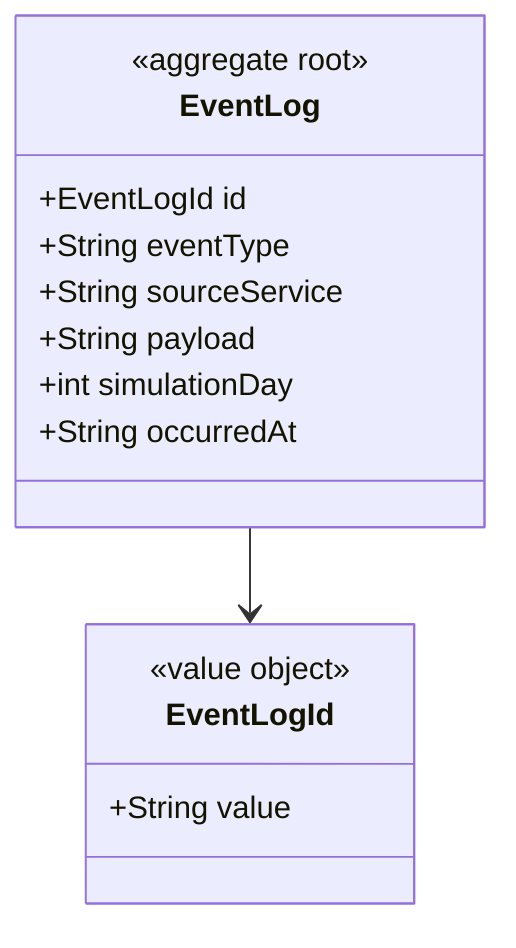
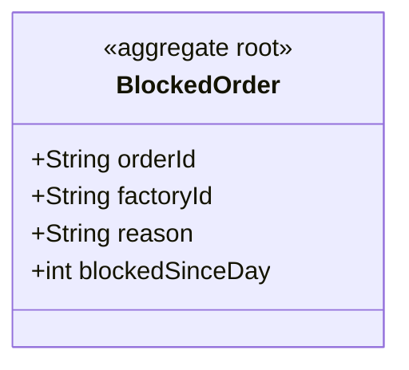
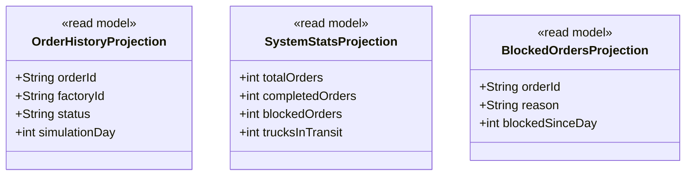

# Reporting — Pedro (Supporting Subdomain)

Consumes all events from all services and builds read-only projections.
Does not publish any event. Does not modify any data.

## Modules

### Module: event-log



### Module: blocked-order



## Read models



## Events consumed

| Event | Source | Action |
|---|---|---|
| time.advanced.v1 | Time | Saves to EventLog |
| truck.registered.v1 | Transport | Saves to EventLog |
| truck.assigned.v1 | Transport | Saves to EventLog, updates stats |
| truck.position.updated.v1 | Transport | Saves to EventLog |
| delivery.created.v1 | Transport | Saves to EventLog |
| delivery.completed.v1 | Transport | Saves to EventLog, updates stats |
| production.order.created.v1 | Production | Saves to EventLog, updates history |
| production.order.started.v1 | Production | Saves to EventLog, updates history |
| production.order.blocked.v1 | Production | Creates BlockedOrder, saves to EventLog |
| production.order.completed.v1 | Production | Saves to EventLog, updates history |
| replenishment.requested.v1 | Warehouse | Saves to EventLog |
| warehouse.stock.changed.v1 | Warehouse | Saves to EventLog, updates stats |

## Package structure

```
reporting-service/
├── event-log/
│   ├── domain/
│   │   ├── EventLog.java
│   │   └── EventLogId.java
│   ├── application/usecase/HandleAnyEvent.java
│   └── infrastructure/messaging/AllEventsListener.java
└── blocked-order/
    ├── domain/BlockedOrder.java
    ├── application/usecase/
    │   ├── GetBlockedOrders.java
    │   ├── GetOrderHistory.java
    │   └── GetSystemStats.java
    └── infrastructure/rest/ReportingController.java
```
