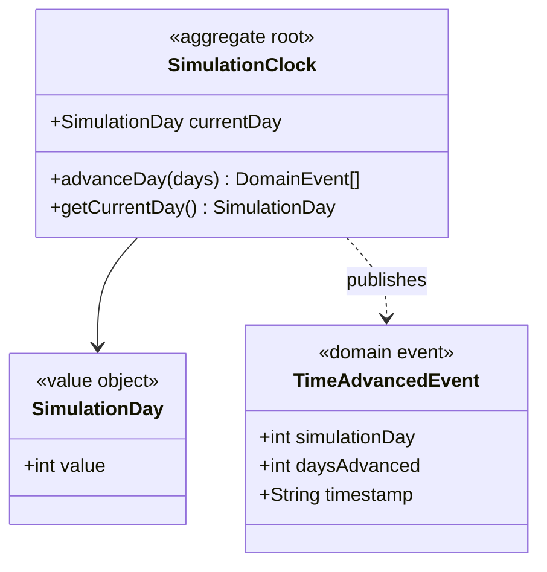
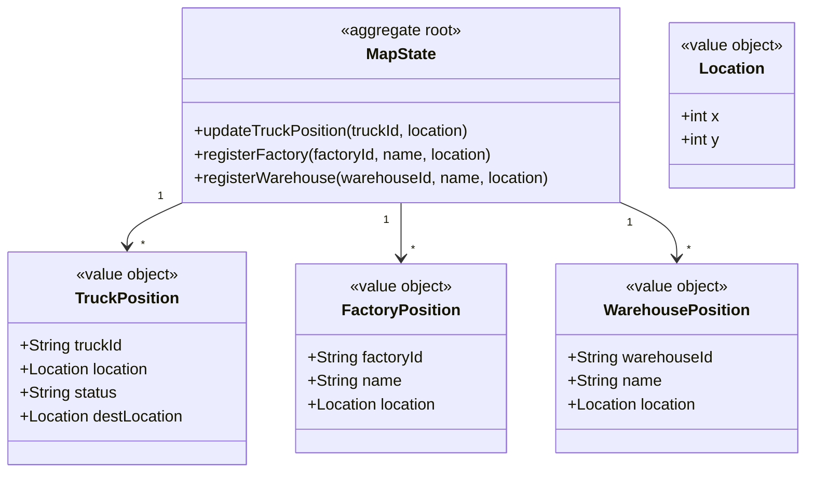
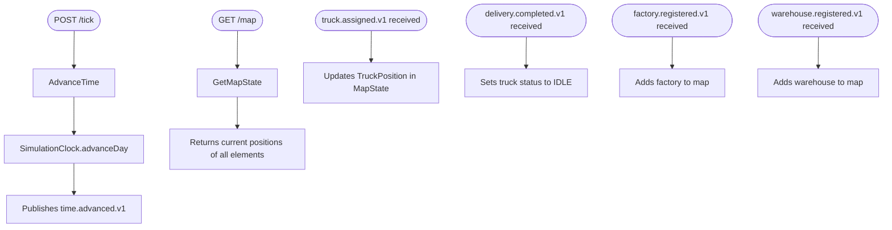

# Time + Map — Ruben

Upstream of all services. Publishes `time.advanced.v1` when the user advances time.
Builds the map by listening to registration events from other services.

## Modules

### Module: simulation-clock



### Module: map-state



## Use cases



## Package structure

```
time-service/
├── simulation-clock/
│   ├── domain/
│   │   ├── SimulationClock.java
│   │   ├── SimulationDay.java
│   │   └── event/TimeAdvancedEvent.java
│   ├── application/usecase/AdvanceTimeUseCase.java
│   └── infrastructure/
│       ├── rest/TickController.java
│       └── persistence/SimulationClockJpaRepository.java
└── map-state/
    ├── domain/
    │   ├── MapState.java
    │   ├── TruckPosition.java
    │   ├── FactoryPosition.java
    │   ├── WarehousePosition.java
    │   └── Location.java
    ├── application/usecase/GetMapStateUseCase.java
    └── infrastructure/
        ├── rest/MapController.java
        └── messaging/MapStateEventListener.java
```
