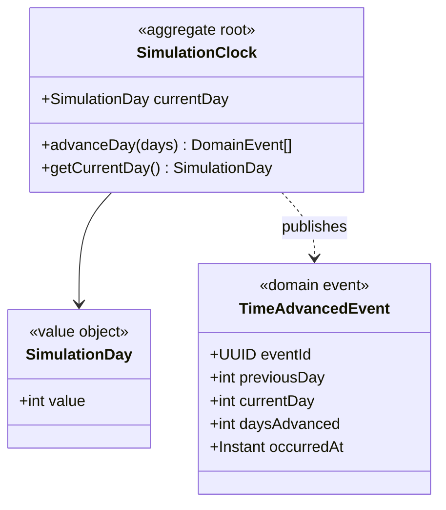
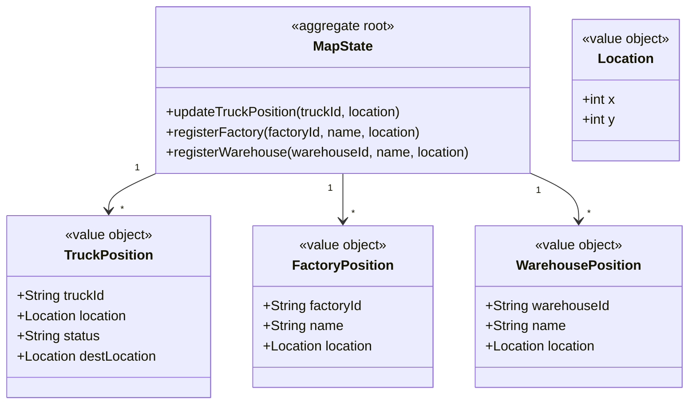
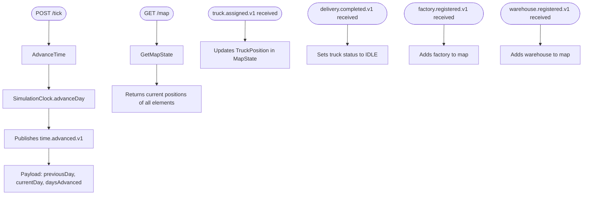

# Time + Map — Ruben

Upstream of all services. Publishes `time.advanced.v1` when the user advances time.
Builds the map by listening to registration events from other services.

## Modules

### Module: simulation-clock

### Module: map-state

## Use cases

## Contracts with other microservices

| Microservice | Publishes | Consumes | Purpose |
|---|---|---|---|
| **Transport** | `time.advanced.v1` | `truck.registered.v1` `truck.assigned.v1` `truck.position.updated.v1` `delivery.completed.v1` | Transport uses the time advance event to move trucks. Time + Map uses Transport events to display trucks on the map and update their positions. |
| **Production** | `time.advanced.v1` | `factory.registered.v1` `factory.updated.v1` *(optional)* | Production uses the time advance event to progress production orders. Time + Map uses Production events to display factories on the map. |
| **Warehouse** | `time.advanced.v1` | `warehouse.registered.v1` `warehouse.updated.v1` *(optional)* | Warehouse may use the time advance event to check stock, consumption or replenishment needs. Time + Map uses Warehouse events to display warehouses on the map. |
| **Reporting** | `time.advanced.v1` | None | Reporting records time advances for history, monitoring and statistics. |

