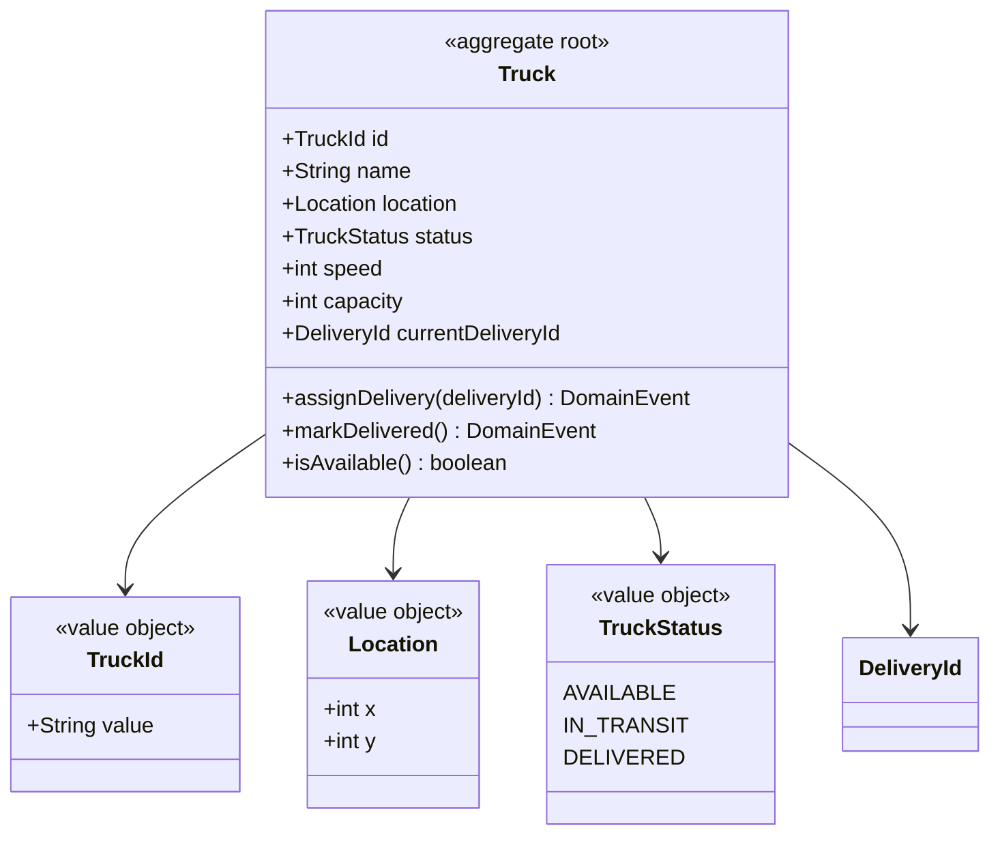
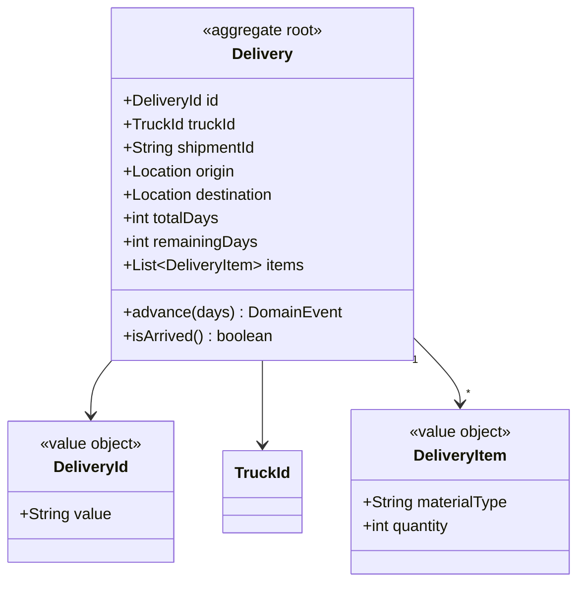
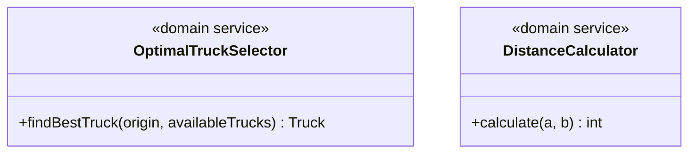
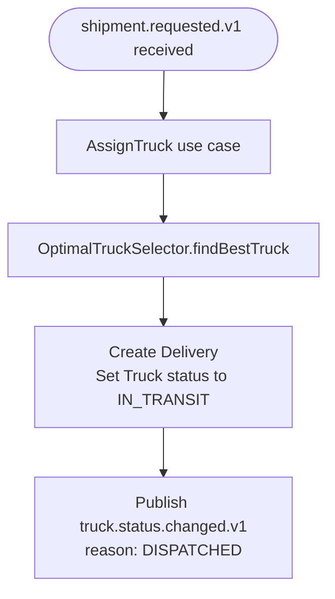
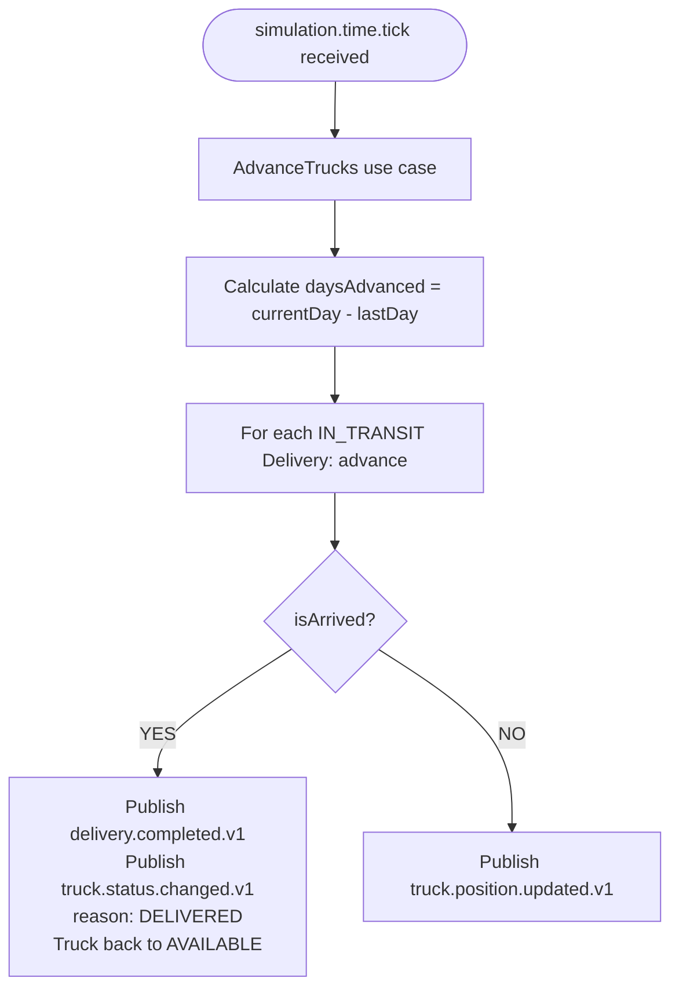
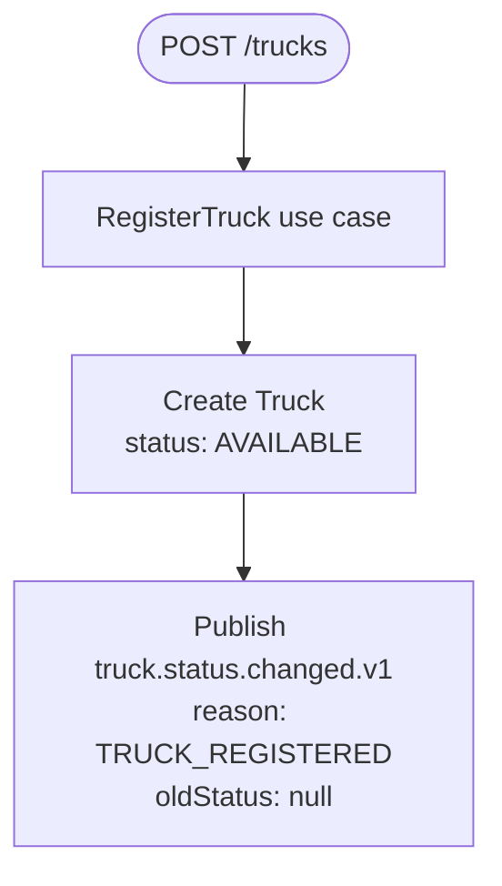

# Transport — Sergi

Manages the truck fleet and deliveries between warehouses.
Moves trucks on each time tick and notifies when a delivery is completed.

---

## Modules

### Module: truck

Each truck is the aggregate root of this module. `Location` and `TruckStatus` are value objects accessed only through `Truck`. `OptimalTruckSelector` is a domain service that crosses both modules to find the best truck given an origin location.

---

### Module: delivery

`Delivery` is the aggregate root. `DeliveryItem` and `DeliveryId` are value objects accessed only through `Delivery`. `Location` is shared with the truck module. `DistanceCalculator` is a domain service.

---

## Domain services

---

## Use cases

### UC1 — shipment.requested.v1 received → Assign truck

### UC2 — simulation.time.tick received → Advance trucks

### UC3 — Register truck (REST)

---

## Events published

| Event | Trigger | Consumed by |
|---|---|---|
| truck.status.changed.v1 | Register, dispatch, delivery, return | Reporting |
| truck.position.updated.v1 | Each tick while IN_TRANSIT | Map (UI), Reporting |
| delivery.completed.v1 | Truck arrives at destination | Warehouses, Reporting |

---

## Events consumed

| Event | Emitted by | Use case triggered |
|---|---|---|
| shipment.requested.v1 | Warehouses / Factories | AssignTruck |
| simulation.time.tick | Ruben (Simulation) | AdvanceTrucks |

---

