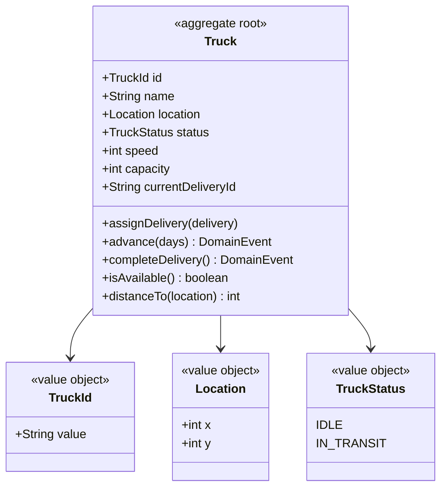
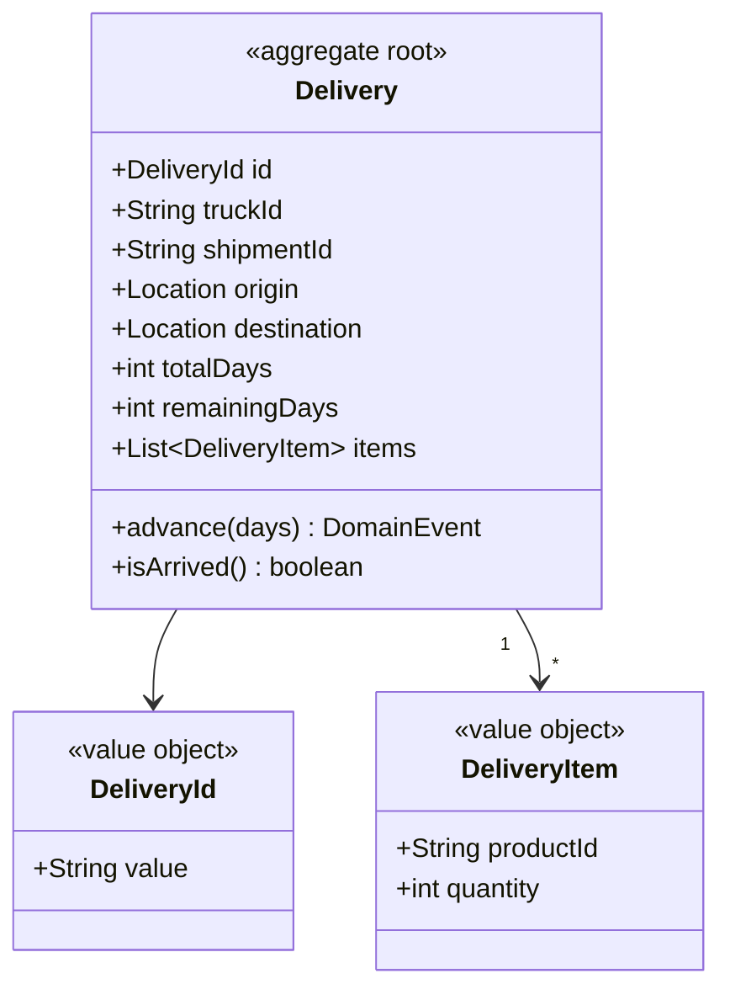
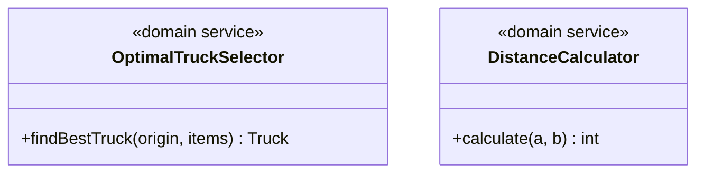
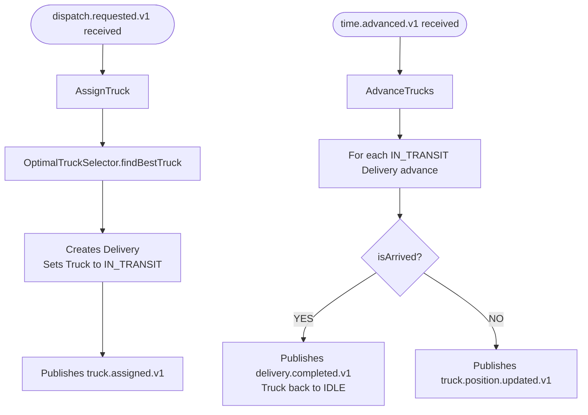

# Transport — Sergi

Manages the truck fleet and deliveries between warehouses.
Moves trucks on each time tick and notifies when a delivery is completed.

## Modules

### Module: truck

### Module: delivery

## Domain services

## Use cases

## Events published

| Event | Consumed by |
|---|---|
| truck.registered.v1 | Time/Map, Reporting |
| truck.assigned.v1 | Time/Map, Reporting |
| truck.position.updated.v1 | Time/Map |
| delivery.created.v1 | Reporting |
| delivery.completed.v1 | Production, Warehouse, Reporting |
