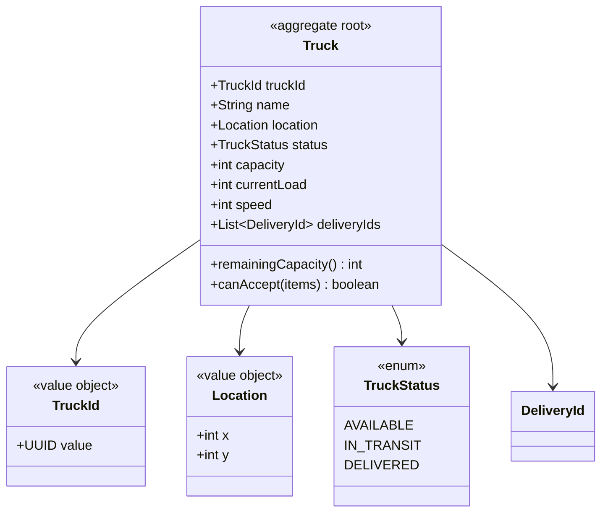
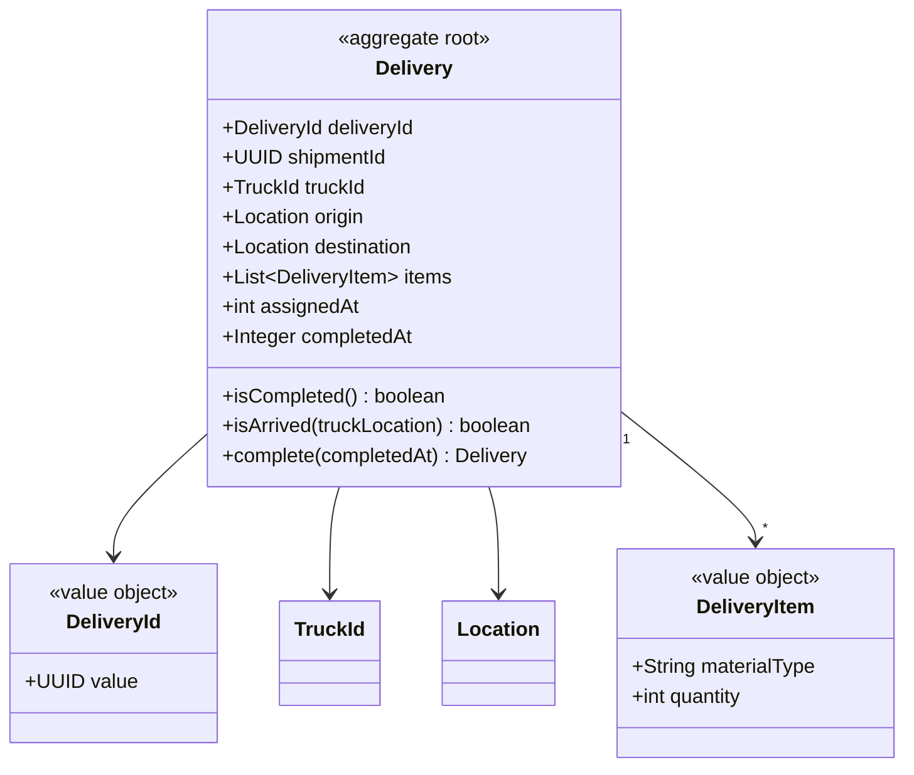
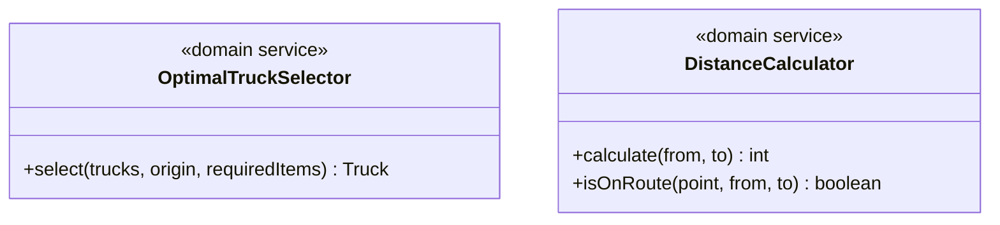
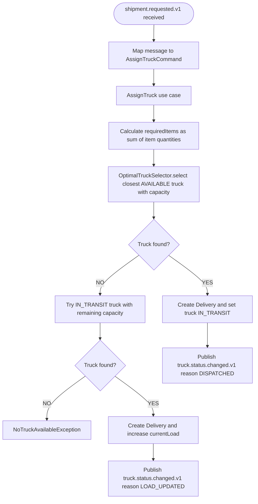
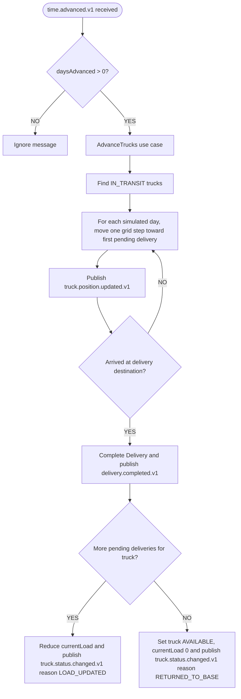
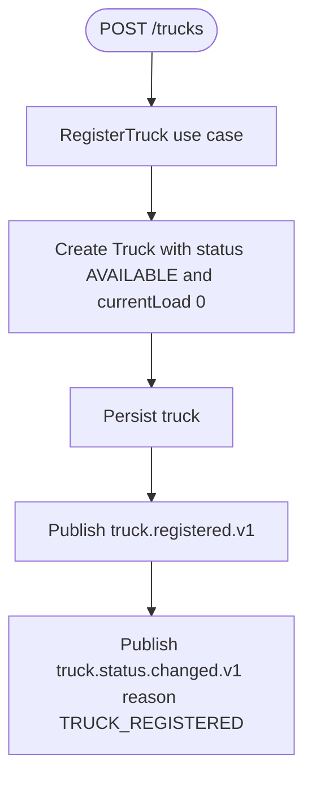
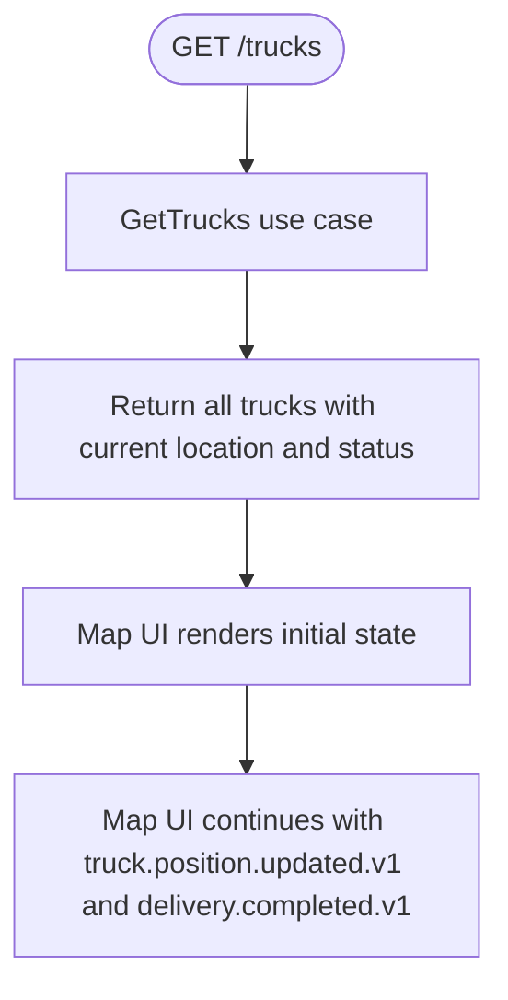

# Transport - Sergi

Manages the truck fleet and deliveries between supply-chain locations.
It assigns trucks to shipment requests, advances trucks on simulation ticks, and publishes events for maps, reporting, and delivery receivers.

---

## Modules

### Module: truck

`Truck` is the aggregate root. It owns identity, current location, operational status, capacity, load, speed, and the list of assigned deliveries.

`Location`, `TruckId`, and `TruckStatus` are value objects/enums accessed through `Truck`. `OptimalTruckSelector` is a domain service that selects the closest available truck with enough remaining capacity.

Current behavior uses `AVAILABLE` and `IN_TRANSIT`. `DELIVERED` exists in the enum and persistence model, but the current flow returns a truck directly to `AVAILABLE` after its last delivery is completed.

---

### Module: delivery

`Delivery` is the aggregate root for an assigned shipment. It links a `shipmentId` from the external request with the assigned `TruckId`, origin/destination, items, assignment day, and optional completion day.

`DeliveryItem` and `DeliveryId` are value objects. `Location` and `TruckId` are shared with the truck module.

---

## Domain services

`DistanceCalculator` uses Manhattan distance. Route checks assume movement on X first and then Y. `AdvanceTrucks` currently moves one grid unit per simulated day toward the first pending delivery for the truck.

---

## Use cases

### UC1 - `shipment.requested.v1` received -> Assign truck

Implementation note: RabbitMQ binding for `shipment.requested.v1` exists, but `DispatchRequestedListener.java` is currently empty. The application use case is implemented; the messaging adapter still needs to map the event into `AssignTruckCommand`.

---

### UC2 - `time.advanced.v1` received -> Advance trucks

`time.advanced.v1` payload currently contains `previousDayNumber`, `currentDayNumber`, and `daysAdvanced`. `currentDayNumber` is used as the completion/status timestamp.

---

### UC3 - Register truck through REST

---

### UC4 - Initial state for Map UI

Map UI is responsible for rendering trucks, not for registering them. Registration is done through `POST /trucks`.

---

## REST Endpoints

| Method | Path | Description | Consumer |
|---|---|---|---|
| `POST` | `/trucks` | Register a truck. Publishes `truck.registered.v1` and `truck.status.changed.v1` | Internal / Admin |
| `GET` | `/trucks` | Get all trucks with current location and status | Map UI |

---

## Events published

| Event | Exchange | Trigger | Consumed by |
|---|---|---|---|
| `truck.registered.v1` | `trucks.exchange` | Truck registration via `POST /trucks` | Reporting, Map UI |
| `truck.status.changed.v1` | `trucks.exchange` | Registration, dispatch, load update, all deliveries completed | Reporting |
| `truck.position.updated.v1` | `trucks.exchange` | Each simulated day while moving | Map UI, Reporting |
| `delivery.completed.v1` | `shipments.exchange` | Truck arrives at a delivery destination | Warehouses, Reporting, Map UI |

---

## Events consumed

| Event | Exchange | Queue | Use case triggered |
|---|---|---|---|
| `shipment.requested.v1` | `shipments.exchange` | `trucks.shipment.requested` | AssignTruck |
| `time.advanced.v1` | `simulation.exchange` | `trucks.time.advanced` | AdvanceTrucks |

---

## Persistence

Transport persists trucks and deliveries with PostgreSQL and Liquibase.

| Aggregate | Repository port | Infrastructure adapter |
|---|---|---|
| `Truck` | `TruckRepository` | `TruckRepositoryAdapter` + `TruckJpaRepository` |
| `Delivery` | `DeliveryRepository` | `DeliveryRepositoryAdapter` + `DeliveryJpaRepository` |
