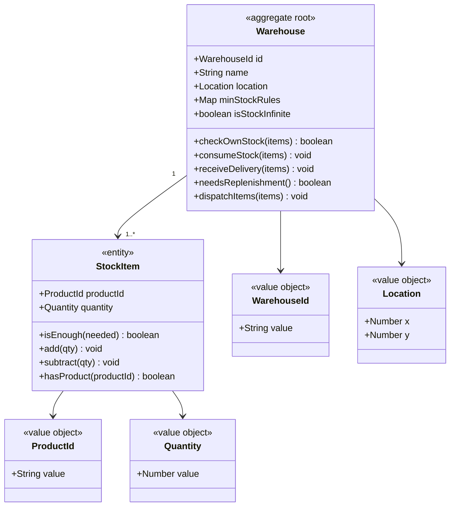
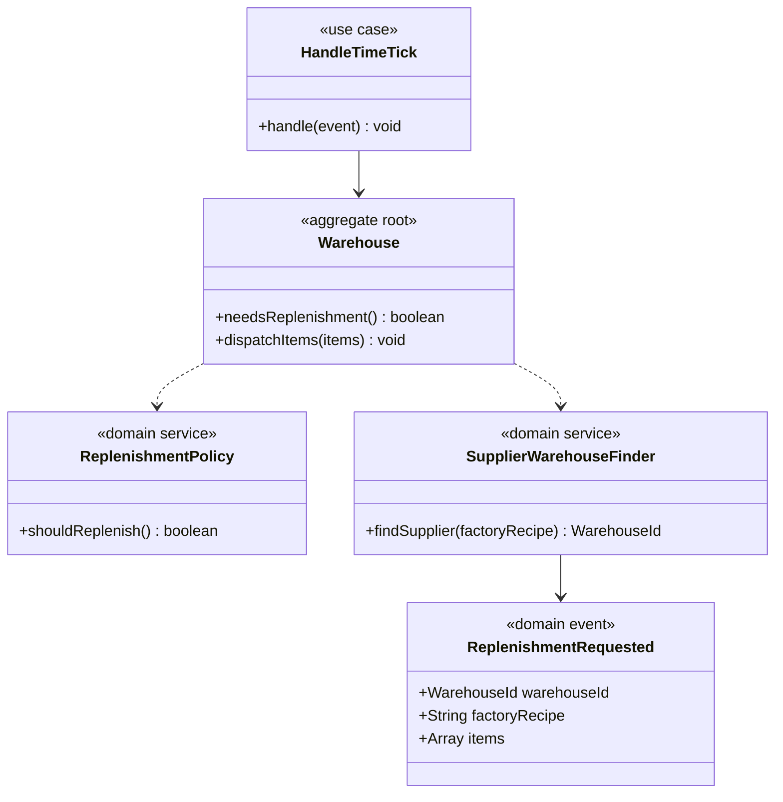
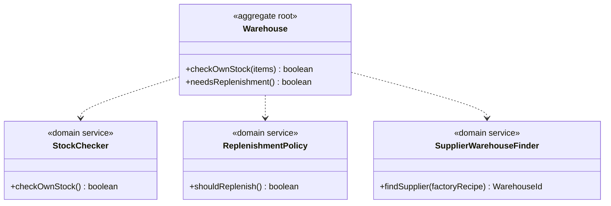
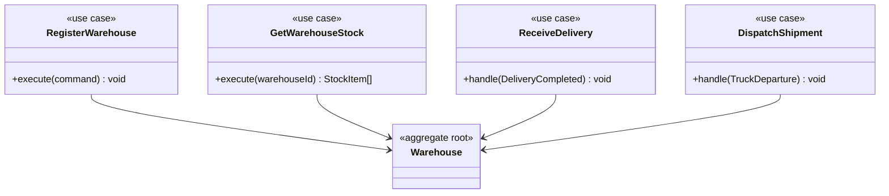
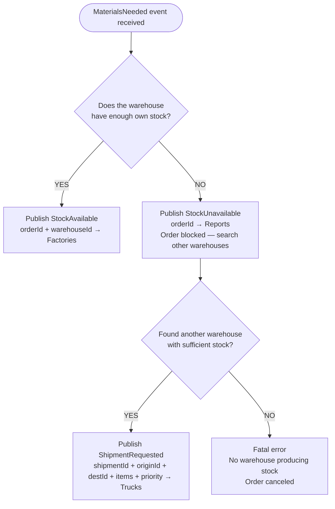

# Warehouses — Bounded Context (Core Domain)
 
## Module: warehouse
 

 
## Module: replenishment
 

 
## Module: services
 

 
## Use cases (Application Layer)
 

 
## Decision logic — production.materials.requested.v1
 

## Events published

| Event | Consumed by |
|---|---|
| replenishment.requested.v1 | Production, Reporting |
| warehouse.stock.changed.v1 | Production, Reporting |
| dispatch.requested.v1 | Transport |
| warehouse.registered.v1 | Time/Map |
