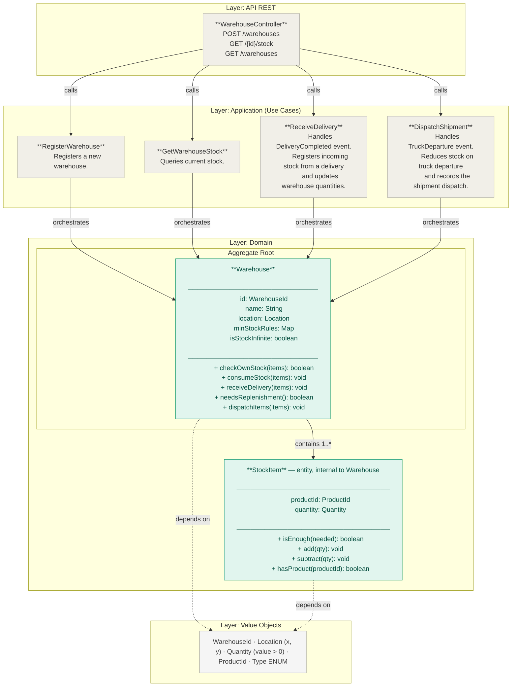
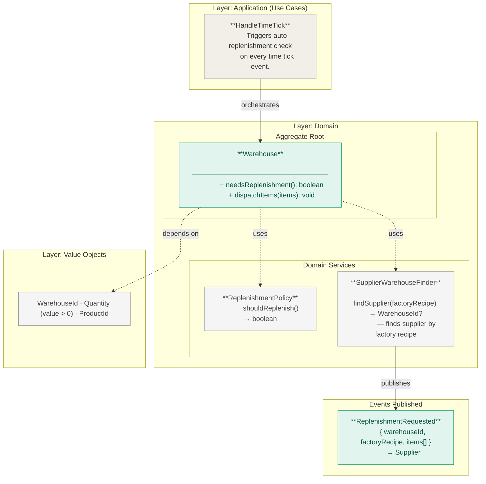
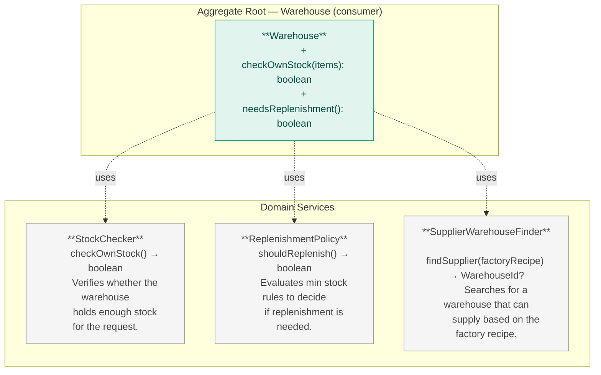
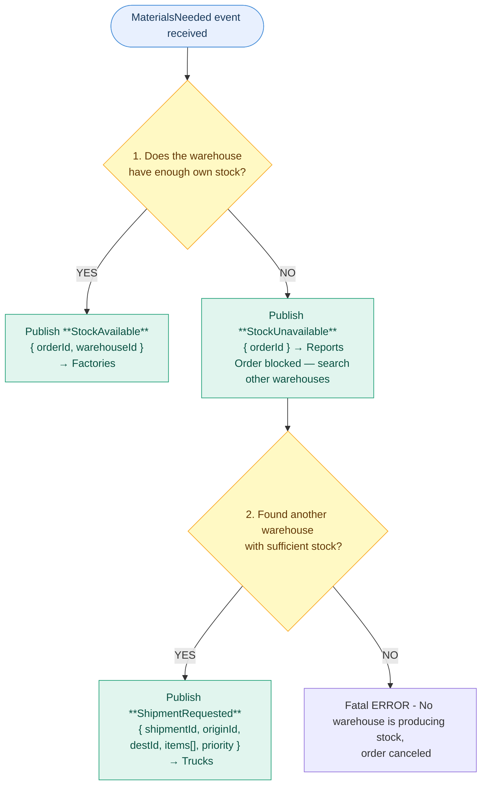

# Warehouse — Pau (Core Domain)

Central node of the system. Manages inventory, minimum stock rules and replenishment requests.

## Modules

### Module: warehouse

 
---
 
## Module: Replenishment
 

 
---
 
## Module: Services
 

 
---
 
## Decision Logic — `production.materials.requested.v1`
 

## Events published

| Event | Consumed by |
|---|---|
| replenishment.requested.v1 | Production, Reporting |
| warehouse.stock.changed.v1 | Production, Reporting |
| dispatch.requested.v1 | Transport |
| warehouse.registered.v1 | Time/Map |

