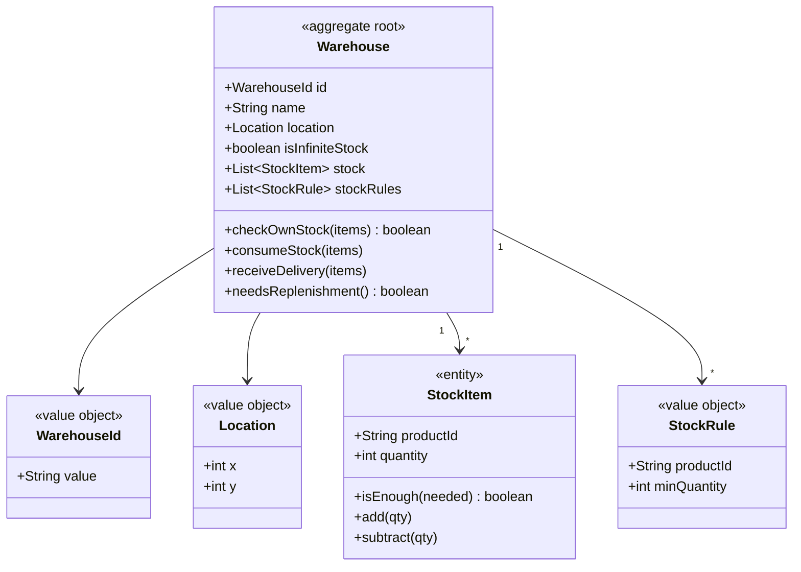
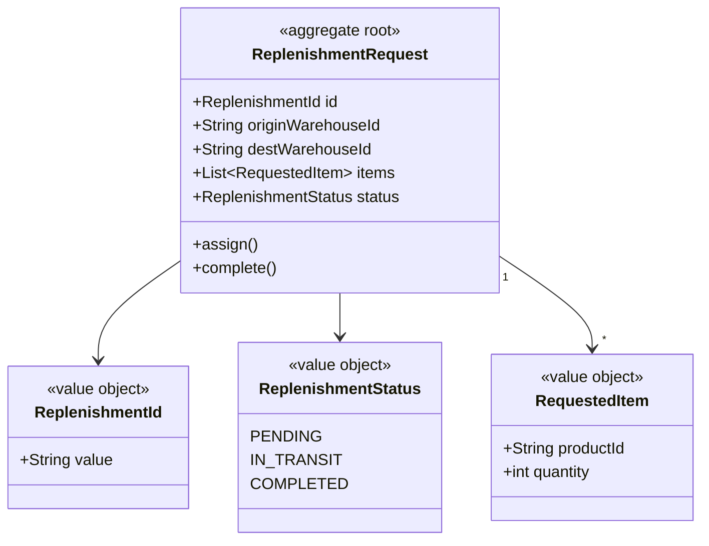
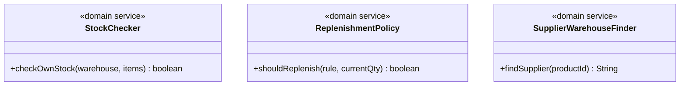
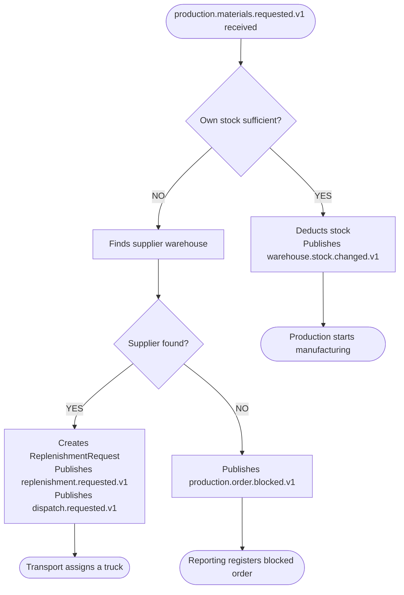

# Warehouse — Pau (Core Domain)

Central node of the system. Manages inventory, minimum stock rules and replenishment requests.

## Modules

### Module: warehouse



### Module: replenishment



## Domain services



## Decision logic — production.materials.requested.v1



## Events published

| Event | Consumed by |
|---|---|
| replenishment.requested.v1 | Production, Reporting |
| warehouse.stock.changed.v1 | Production, Reporting |
| dispatch.requested.v1 | Transport |
| warehouse.registered.v1 | Time/Map |

## Package structure

```
warehouse-service/
├── warehouse/
│   ├── domain/
│   │   ├── Warehouse.java
│   │   ├── StockItem.java
│   │   ├── StockRule.java
│   │   ├── WarehouseId.java
│   │   ├── Location.java
│   │   └── service/
│   │       ├── StockChecker.java
│   │       ├── ReplenishmentPolicy.java
│   │       └── SupplierWarehouseFinder.java
│   ├── application/usecase/
│   │   ├── HandleMaterialsRequested.java
│   │   ├── HandleDeliveryCompleted.java
│   │   ├── HandleTimeAdvanced.java
│   │   └── RegisterWarehouse.java
│   └── infrastructure/
│       ├── rest/WarehouseController.java
│       ├── persistence/WarehouseJpaRepository.java
│       └── messaging/MaterialsRequestedListener.java
└── replenishment/
    ├── domain/
    │   ├── ReplenishmentRequest.java
    │   ├── ReplenishmentId.java
    │   ├── RequestedItem.java
    │   └── ReplenishmentStatus.java
    ├── application/usecase/CreateReplenishmentRequest.java
    └── infrastructure/messaging/ReplenishmentPublisher.java
```
